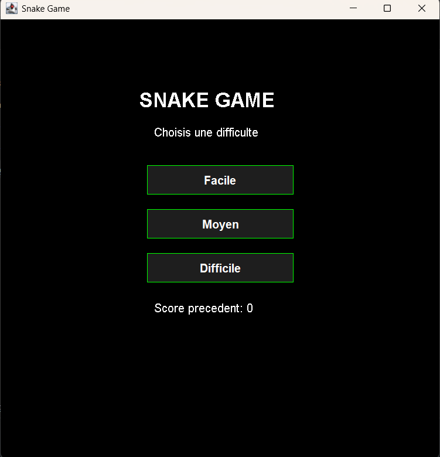

# 📜 Preview


---

# 🐍 SnakeJV (Java)

Un petit jeu Snake développé en Java avec une interface graphique moderne (Swing).

## 🎮 Fonctionnalités

* Menu interactif avec boutons
* 3 niveaux de difficulté :

  * 🟢 Facile
  * 🟡 Moyen
  * 🔴 Difficile
* Système de score
* Retour automatique au menu après Game Over
* Interface sombre et minimaliste

---

## 📸 Aperçu



---

## 🚀 Lancer le projet

### 🔹 Avec Java (manuel)

```bash
javac SnakeGame.java
java SnakeGame
```

---

### 🔹 Avec Maven

```bash
mvn package
java -jar target/snake-game-1.0-SNAPSHOT.jar
```

---

## 📁 Structure du projet

```
snake-game/
├── pom.xml
└── src/
    └── main/
        └── java/
            └── SnakeGame.java
```

---

## 🎯 Contrôles

* ⬆️⬇️⬅️➡️ : déplacer le serpent
* 🖱️ souris : cliquer sur les boutons du menu

---

## 🛠️ Technologies utilisées

* Java 25
* Swing (interface graphique)
* Maven (build)

---

## 💡 Améliorations possibles

* 🔊 Ajouter des effets sonores
* 💾 Sauvegarde du meilleur score
* 🎨 Améliorer le design (animations, thèmes)
* 🧱 Ajouter des obstacles
* 🚀 Migration vers JavaFX

---

## 📄 Licence

Projet avec [MIT License](https://raw.githubusercontent.com/Isax820/SnakeJV/refs/heads/main/LICENSE) – tu peux faire un fork et l’améliorer 👍

---

## 🙌 Auteur

Créé pour apprendre Java et s’amuser 🎮
